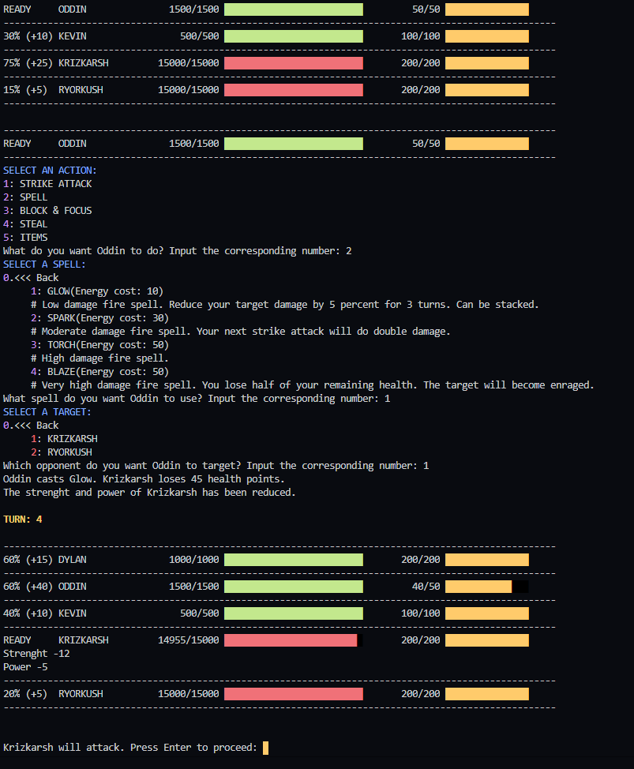

# RPG Battle Script

## Description
### Preview

## More about this project

### Related course
UDEMY | THE COMPLETE PYTHON 3 COURSE - BEGINNER TO ADVANCED!  
Section 4: Project #2 - RPG Battle Script

### Technologies | Libraries | Frameworks | Tools  
- Python 3

### Details | Comments
- Albeit this project was made coding along while following the related course, several changes have been made from the [original project](https://github.com/nickqidev/python_text_battle).  

### Status
Abandonned

#### Last update
29/03/2020

#### Last update (README.md)
27/05/2020